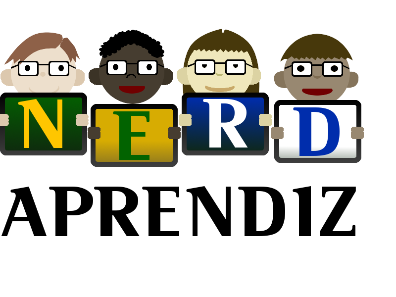

# Nerd Aprendiz

## ** IMPORTANTE **

Este projeto ainda é um rascunho.

## Apresentação

O *Projeto Nerd Aprendiz* é uma idéia colaborativa para divulgar a tecnologia para crianças e adolescentes com pouco ou nenhum recurso financeiro.

O projeto tem como principal objetivo, inicializar crianças e jovens, que não possuam condições financeiras de ter um computador em casa, a aprender a computação de uma forma simples e divertida. Com professores engajados e que compartilham de uma mesma ideia. 
 Com aulas que vão desde a iniciação a computação, passando pelas mais diversas áreas que abrangem a tecnologia da informação, os jovens adquirirão, um conhecimento básico da área que despertar seu interesse, para assim, iniciar um curso técnico com um professor especialista.
Os projeto não terá apenas áreas técnicas, contará também com professores voluntários, que ensinarão esportes, música, aulas de reforço, e o que mais for possível para encaminhar o jovem a vida profissional como um cidadão de bem.

## Tópicos

* [Alunos](docs/Alunos.md)
* [Arrecadação de Fundos](docs/Arrecadação-de-Fundos.md)
* [Aulas](docs/Aulas.md)
* [Computadores](docs/Computadores.md)
* [Empresas](docs/Empresas.md)
* [Estatuto Social](docs/estatuto-social.md)
